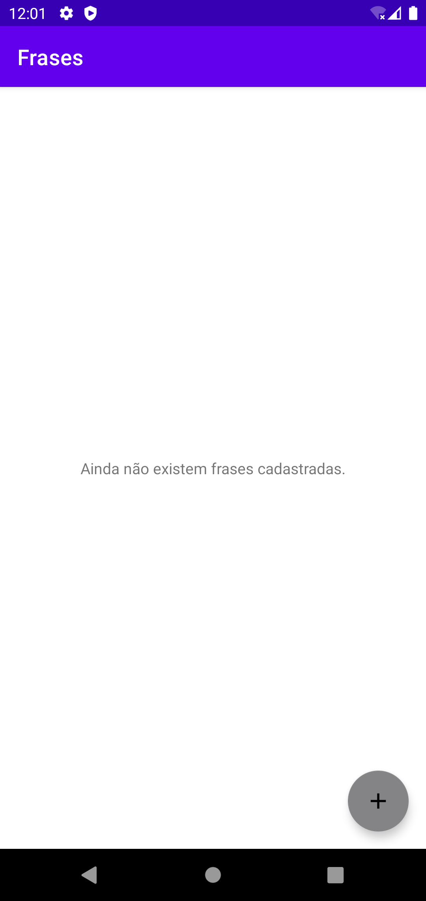
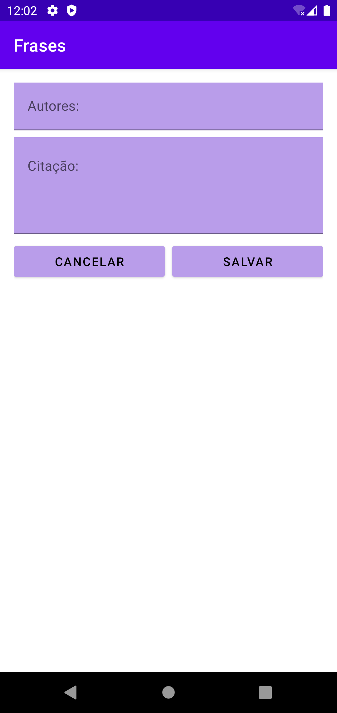
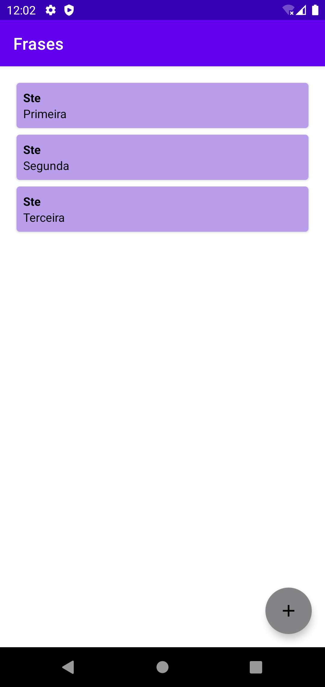
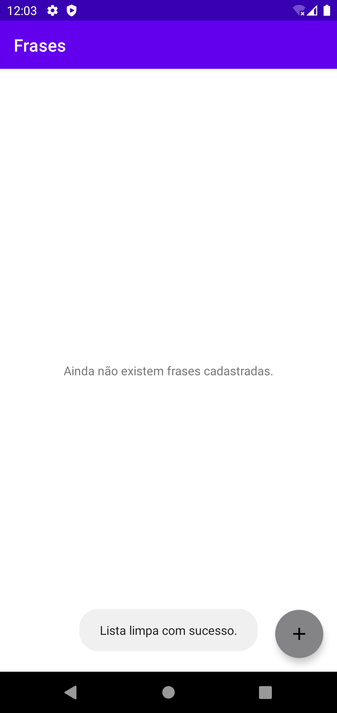

<h1>
    <b>Primeiro Aplicativo feito em Android/Kotlin 🚀</b> 
     
</h1>

- Aplicativo realizado durante as aulas do Módulo 1 - Fundamentos em Desenvolvimento Mobile Android na XPE. 
   

    - Objetivo do aplicativo foi criar um app que armazene frases com o nome de autores e as suas citaçoes.

<h3>Demonstrativo das telas</h3>

    

